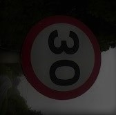
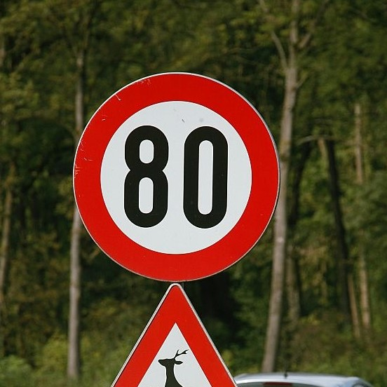
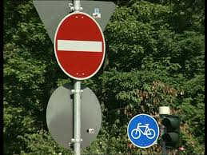
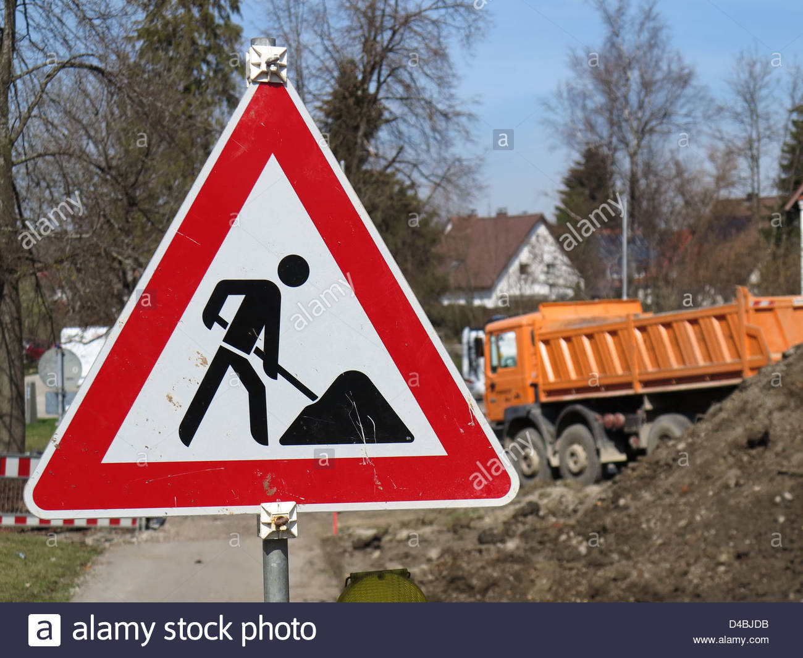
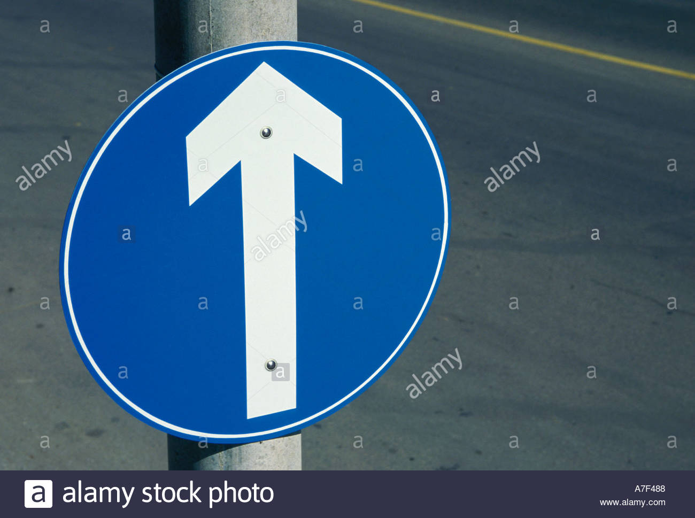
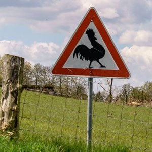

 # **Traffic Sign Recognition** 

 ## Writeup

 **Build a Traffic Sign Recognition Project**

 The goals / steps of this project are the following:
 * Load the data set (see below for links to the project data set)
 * Explore, summarize and visualize the data set
 * Design, train and test a model architecture
 * Use the model to make predictions on new images
 * Analyze the softmax probabilities of the new images
 * Summarize the results with a written report

 [//]: # (Image References)

 [image1]: ./writeup_images/visualization1.png "Visualization - occurences"
 [image2]: ./writeup_images/visualization2.png "Visualization - sign classes"
 [image3]: ./writeup_images/external_signs.png "Visualization - converted external sign"
 
 ## Rubric Points
 ### Here I will consider the [rubric points](https://review.udacity.com/#!/rubrics/481/view) individually and describe how I addressed each point in my implementation.  

 ---
 ### Writeup / README

 #### 1. Provide a Writeup / README that includes all the rubric points and how you addressed each one. You can submit your writeup as markdown or pdf. You can use this template as a guide for writing the report. The submission includes the project code.

I couldn't test if the images appears well in the workspace writeup.md. I have made a copy of it in my repo, it is recommended to check the writeup there:

https://github.com/windmip/CarND-Traffic-Sign-Classifier/blob/master/writeup.md

 The submitted workspace contains the required files:
 * CarND-Traffic-Sign-Classifier.ipynb
 * report.html
 * writeup.md

 ### Data Set Summary & Exploration

 #### 1. Provide a basic summary of the data set. In the code, the analysis should be done using python, numpy and/or pandas methods rather than hardcoding results manually.

 The data set contains cropped photos taken from german traffic signs converted to small RGB images.
 In the code cell #3 I made a report describing the size input data set:

 | Set           | Size         |
 | ------------- |-------------:|
 | Training      | 34799        |
 | Validation    |  4410        |
 | Test          | 12360        |
 | External test |     6        |

 Properties of each image are 32x32 24bit RGB, so shape is (32,32,3)

 The number of unique sign classes is 43

 #### 2. Include an exploratory visualization of the dataset.

 I have made two visualization image. The first one shows each sign classes, the second one describes the data set population by unique classes

 Unique classes
 ![alt text][image2]

 Occurences by unique classes in each set. It should be noted that there are peaks on some class types in the training set, It could affect the result.
 ![alt text][image1]

 ### Design and Test a Model Architecture

 #### 1. Describe how you preprocessed the image data. What techniques were chosen and why did you choose these techniques? Consider including images showing the output of each preprocessing technique. Pre-processing refers to techniques such as converting to grayscale, normalization, etc. (OPTIONAL: As described in the "Stand Out Suggestions" part of the rubric, if you generated additional data for training, describe why you decided to generate additional data, how you generated the data, and provide example images of the additional data. Then describe the characteristics of the augmented training set like number of images in the set, number of images for each class, etc.)

 Pre processing has one step, data was normalized in code cell #5. Normailizing data lowers the impact of rounding errors. Normalized data has a mean of zero, because it increases the efficiency of training with gradient descent.

 #### 2. Describe what your final model architecture looks like including model type, layers, layer sizes, connectivity, etc.) Consider including a diagram and/or table describing the final model.

 The model was written in code cells #6-12. I have chosen LeNet-5 architecture described in previous lessons. There are no changes in layer count but in output shapes.

 | Layer         		      |     Description	        					                 | 
 |:---------------------:|:---------------------------------------------:| 
 | Input         		      | 32x32x3 RGB image   							                   |  
 | Convolution 5x5     	 | 1x1 stride, valid padding, outputs 28x28x12 	 |
 | RELU					             |												                                   |
 | Max pooling	      	   | 2x2 stride,  outputs 14x14x12 				            |
 | Convolution 5x5	      | 1x1 stride, valid padding, outputs 10x10x32   |
 | RELU					             |												                                   |
 | Max pooling	      	   | 2x2 stride,  outputs 800 (5x5x32 flatten)     |
 | Fully connected		     | W,b shapes are (800,240),(240) , outputs 240  |
 | Fully connected		     | W,b shapes are (240,84),(84) , outputs 84     |
 | Fully connected		     | W,b shapes are (84,43),(43) , outputs 43      |
 | Softmax classification| Fisrt cross entropy, then softmax was calculated between logits and one hot labels|
 | Adam optimizer | Error minimizing was done using adam_optimizer |

 #### 3. Describe how you trained your model. The discussion can include the type of optimizer, the batch size, number of epochs and any hyperparameters such as learning rate.
 
 I used Adam optimizer for optimizing my models output. It is based on adam algorithm, an extension of Stochastic Gradient Descent. The table below describes the hyperparameters:
 | Parameter name | Description	| Value | 
 |:--------------:|:-----------:|:-----:|
 |epochs|The number of training runs on each batch| 36|
 |batch size|The number of images in each batch| 512 |
 |mu|The mean of truncate mean distribtion used in W matrices| 0 |
 |sigma|The standard deviation of the normal distribution| 0.1 | 
 |rate|0.0028|learing rate of optimizing algoritm| 

 #### 4. Describe the approach taken for finding a solution and getting the validation set accuracy to be at least 0.93. Include in the discussion the results on the training, validation and test sets and where in the code these were calculated. Your approach may have been an iterative process, in which case, outline the steps you took to get to the final solution and why you chose those steps. Perhaps your solution involved an already well known implementation or architecture. In this case, discuss why you think the architecture is suitable for the current problem.

I have started with LeNet-5 and kept going with it not changing the architecture but the shapes of layers. I have chosen it because it uses convolution layers suitable for classifying statistical invariant objects like traffic signs.

My final model results were:
 * Validation set accuracy of 0.957
 * Test set accuracy of 0.945
 * External test set accuracy of 0.8

I was modifying only one type of hyperparameter on each training session to not get lost.

I found that the depth of first and second convolution layer is not enough for a 3-depth input, so I modified them to 16 and 32, rescpectively. Fully connected layer inputs were adepted to them.

Validation accuracy on consecutive epochs was alternating around a slightly emerging result, so I set a large number on epoch number.

Increasing the batch size from 128 to 512 resulted about 1% bigger validation accuracy
 
Mean of distribution being in the center helps gradient descent to work better. Decreasing and increasing the width of distribution caused lower accuracy, so I left in unchanged
 
Learning rate was set to 0.01 first. With this value error decreased very fast but the increasing of validation accuracy suddenty stopped after a few epochs, so I lowered learning rate and set the number of epochs bigger. These two settings caused approx 3% boost in validation accuracy.

 ### Test a Model on New Images

 #### 1. Choose five German traffic signs found on the web and provide them in the report. For each image, discuss what quality or qualities might be difficult to classify.

 Here are seven German traffic signs that I found on the web. There is a 'Chicken warning' sign explained later.
 
| Sign			        |     Difficulty	        					| 
 |:---------------------:|:---------------------------------------------:| 
 | Speed limit (30km/h)      		| Brightness, contrast lowered, image rotated   									| 
 | Speed limit (80km/h)      		| Nothing  									| 
 | No entry					| Angle of photo, back of other signs									|
 | Road work			| Nothing  							|
 | Ahead only			| Angle of photo    							|
 | Chicken warning			|   class set not contains it    							|
 
 The original images from the web:

  
    
  
  
  
    

The result after the images were loaded:
![alt text][image3]

 #### 2. Discuss the model's predictions on these new traffic signs and compare the results to predicting on the test set. At a minimum, discuss what the predictions were, the accuracy on these new predictions, and compare the accuracy to the accuracy on the test set (OPTIONAL: Discuss the results in more detail as described in the "Stand Out Suggestions" part of the rubric).

I ran into a strange issue with prediction certainity and I don't understand, why. Maybe it is a numerical stability issue. First, I have used a model from a different training session with a validation accuracy of 96%. It performed 93.5% accuracy on test set and 57% on external test set (7 signs) with approx 50% 40% 30% softmax results on first three largest values shown with topk. This state is saved under the name 'lenet' Then I messed up everything and had problems restoring it, so I trained my model again. I changed just the epoch from from 32 to 36 nothing else. The state is saved under 'lenet5'. This last training was included in this writeup has a validation accuracy of 95.7%, test accuracy of 94.5% and 75% accuracy on external test set. Softmax topk showed almost 100% certainity on every external signs... I changed all the external signs to another ones, and included a "chicken warning" sign to self-check the model. Resulted 75% accuracy with almost 100% certainity on them(on the misclassified too!) but on the chicken-warning-sign, the model thought it is 75% "Right-of-way at the next intersection" or perhaps 25% "Beware of ice/snow" or something else.

Also strange that the misclassified image had no difficulties with angle, brightness or else.

Here are the results of the prediction:

 | Image			        |     Prediction	        					| 
 |:---------------------:|:---------------------------------------------:| 
 | Speed limit (30km/h)      		| Speed limit (30km/h)   									| 
 | Speed limit (80km/h)      		| Speed limit (30km/h)   									| 
 | No entry					| No entry											|
 | Road work			| Road work      							|
 | Ahead only			| Ahead only      							|
 | Chicken warning			|   Right-of-way at the next intersection    							|
 
 The model was able to correctly guess 4 of the 5 traffic signs, which gives an accuracy of 75%. This is lower than the accuracy on test set. 

 #### 3. Describe how certain the model is when predicting on each of the five new images by looking at the softmax probabilities for each prediction. Provide the top 5 softmax probabilities for each image along with the sign type of each probability. (OPTIONAL: as described in the "Stand Out Suggestions" part of the rubric, visualizations can also be provided such as bar charts)

 The code for making predictions on my final model is located in the 11th cell of the Ipython notebook.
 The model is absolute sure what a sign is, even when misclassifies it. Except on the last one, the model has a bit uncertainity on it.

Speed limit 30
 | Probability         	|     Prediction	        					| 
 |:---------------------:|:---------------------------------------------:| 
 | .98         			| Speed limit 30 									| 
 | .02     				| Speed limit 70 										|
 | .00					| No entry											|
 | .00	      			| Speed limit 20					 				|
 | .00				    | Speed limit 120      							|

Ahead only
| Probability         	|     Prediction	        					| 
 |:---------------------:|:---------------------------------------------:| 
 | 1.00         			| Stop sign   									| 
 | .00     				| No passing 										|
 | .00					| Go straight or right											|
 | .00	      			| Children crossing					 				|
 | .00				    | Turn left ahead      							|

No entry
| Probability         	|     Prediction	        					| 
 |:---------------------:|:---------------------------------------------:| 
 | 1.00         			| No entry   									| 
 | .00     				| Stop 										|
 | .00					| End of no passing											|
 | .00	      			| No passing					 				|
 | .00				    | End of all speed and passing limits      							|

Road work
| Probability         	|     Prediction	        					| 
 |:---------------------:|:---------------------------------------------:| 
 | 1.00         			| Road work   									| 
 | .00     				| Wild animals crossing 										|
 | .00					| 	Speed limit 80										|
 | .00	      			| Bumpy road					 				|
 | .00				    | Speed limit 20      							|

Speed limit 30 (Speed limit 80 misclassified)
| Probability         	|     Prediction	        					| 
 |:---------------------:|:---------------------------------------------:| 
 | 1.00         			| Speed limit 30   									| 
 | .00     				| Keep left 										|
 | .00					| 	Turn right ahead										|
 | .00	      			| Speed limit 80					 				|
 | .00				    | Speed limit 50      							|

Right-of-way at the next intersection (not valid sign misclassified)
| Probability         	|     Prediction	        					| 
 |:---------------------:|:---------------------------------------------:| 
 | 0.76         			| Right-of-way at the next intersection   									| 
 | 0.23     				| Beware of ice/snow 										|
 | 0.00					| 	Slippery road										|
 | 0.00	      			| Double curve					 				|
 | 0.00				    | Speed limit 100      							|

 ### (Optional) Visualizing the Neural Network (See Step 4 of the Ipython notebook for more details)
 #### 1. Discuss the visual output of your trained network's feature maps. What characteristics did the neural network use to make classifications?

